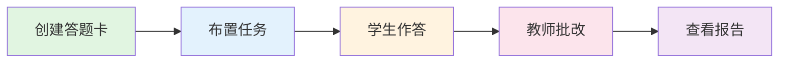
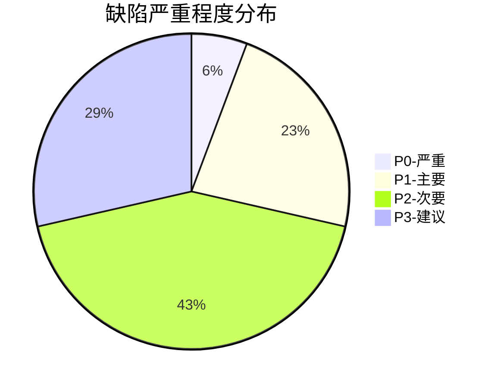

# 阶段性工作述职报告

  
    测试工程师工作汇报
  

  

    汇报人：李夕夕
  

  

    入职时间：2025年9月
  

  

    岗位：测试工程师
  

  

    汇报周期：2025年9月 - 2025年12月
  

---
layout: default
transition: fade-out
---

# 目录

  
一、入职概况

  
工作背景 · 主要职责

  
二、核心业务模块

  
答题卡系统 · 两种评分模式

  
三、业务流程

  
完整业务链路 · 数据流转逻辑

  
四、参与测试版本

  
v1.3 我的资源 · v1.3 布置任务 · v1.4 计分模式

五、测试用例设计

  
功能 · 边界值 · 异常流程

  
六、测试执行统计

  
用例数据 · 缺陷分布

  
七、典型问题案例

  
计算精度 · 批改进度 · 状态管理

  
八、团队协作

  
产品协作 · 开发协作

  
九、个人成长

  
收获成长 · 不足改进

  
十、后续计划

  
短期 · 中期 · 长期

---
layout: two-cols
transition: slide-up
---

# 一、入职概况

## 工作背景

- **入职时间**：2025 年 9 月
- **岗位**：测试工程师
- **主要负责**：教师端 App 质量保障

## 工作内容

深度参与**答题卡模块**的测试工作，涵盖：

- ✅ 资源管理
- ✅ 任务布置
- ✅ 批改评分
- ✅ 报告统计

::right::

## 业务理解

通过三个多月的工作，对答题卡模块有了深入理解：

<v-clicks>

- 📚 完整业务流程
- 🔄 数据流转逻辑
- 📊 两种评分模式
- 🎯 关键业务规则

</v-clicks>

---
layout: default
transition: slide-left
---

# 二、核心业务模块：答题卡系统

## 模块定位

教师端 App 支持的任务类型：

  <h3 class="text-center mb-2">📝 作业和测验</h3>
  
教师布置给学生完成的练习或考试

  
核心功能

  <h3 class="text-center mb-2">📚 资源</h3>
  
课件、视频等学习资料的下发

  <h3 class="text-center mb-2">🎓 课程</h3>
  
结构化的课程内容推送

**答题卡**是作业和测验的重要子类型，是使用频率最高的功能之一

---
layout: default
transition: fade
---

# 答题卡的两种评分模式

## 🎯 正确率模式

**适用场景**

- 日常练习
- 课后作业

**统计方式**

- 只看对错
- 计算正确率

**报告展示**

- ✓ 正确率
- ✓ 错题数量
- ✓ 答对/答错人数

## 📊 计分模式

**适用场景**

- 单元测试
- 期中期末考试

**统计方式**

- 每题设置分值
- 计算得分

**报告展示**

- ✓ 总分/平均分
- ✓ 得分率
- ✓ 排名

---
layout: default
transition: slide-up
---

# 计分模式特殊规则

## 多选题少选得分策略

  <h3 class="font-bold text-center mb-3">策略一：不开启</h3>
  
少选即判错，得0分

  

    
示例：正确答案ABCD

    
学生选ABC → 得0分

  

  <h3 class="font-bold text-center mb-3">策略二：少选得一半分</h3>
  
少选且未选错，得满分的50%

  

    
示例：满分10分

    
学生选ABC → 得5分

  

  <h3 class="font-bold text-center mb-3">策略三：少选得N分</h3>
  
少选且未选错，得固定分值

  

    
示例：设置得3分

    
学生选ABC → 得3分

  

⚠️ 注意：如果多选了错误选项（如选了ABCE），无论哪种策略都判为错误，得0分

---
layout: default
transition: slide-left
---

# 三、完整业务流程

  
📝

  
创建答题卡

  
配置题目和答案

  
📤

  
布置任务

  
选择班级和学生

  
✍️

  
学生作答

  
提交答案

  
✅

  
教师批改

  
自动+人工批改

  
📊

  
查看报告

  
统计分析

---
layout: default
---

# 阶段一：创建答题卡

## 操作步骤

1. 进入"我的资源"，点击新建答题卡
2. 填写基本信息（名称、年级、学科）
3. 添加题目分组（如：一、选择题）
4. 在分组下添加具体题目
5. 选择评分模式
6. 如果是计分模式，设置每题分值
7. 保存答题卡

## 支持的题型

**选择题（单选/多选）**

- 2-8 个选项可配置
- 支持图片选项

**填空题**

- 支持多个空
- 每空独立判断

**解答题**

- 需要教师人工批改
- 支持图片/手写答案

💡 答题卡保存后状态为"未下发"，可编辑、可删除、可复用

---
layout: default
---

# 阶段二：布置任务

## 布置流程

| 步骤 | 操作                     |
| ---- | ------------------------ |
| 1    | 选择任务类型：作业或测验 |
| 2    | 选择布置对象：班级/学生  |
| 3    | 选择要布置的答题卡       |
| 4    | 填写任务名称             |
| 5    | 设置截止时间             |
| 6    | 设置答案发布策略         |
| 7    | 确认布置                 |

## 答案发布策略

<v-clicks>

**立即可见**

- 提交后学生立刻能看到答案

**提交后可见**

- 学生提交自己的答案后才能看答案

**指定时间可见**

- 到达设定时间后统一公布答案

</v-clicks>

  
⚠️ 布置完成后：

  <ul class="text-sm">
    <li>任务推送至学生端</li>
    <li>该答题卡被锁定，不可再编辑或删除</li>
  </ul>

---
layout: default
---

# 阶段三 & 四：学生作答与教师批改

## 学生作答

| 题型   | 作答方式       |
| ------ | -------------- |
| 选择题 | 点击选项       |
| 填空题 | 文字输入       |
| 解答题 | 文字/图片/手写 |

**数据记录**

- 学生答案
- 作答用时
- 提交时间

## 教师批改

**自动批改**

- 选择题系统自动判分
- 自动生成对错结果

**人工批改**

- 填空题/解答题教师批改
- 判定：正确/错误/部分正确
- 计分模式下需打分

**批改模式**

- 按题批改：看所有学生的同一题
- 按人批改：看同一学生的所有题

✓ 批改过程自动保存草稿，防止丢失

---
layout: default
---

# 阶段五：查看报告

## 报告统计维度

| 统计维度     | 正确率模式展示       | 计分模式展示     |
| ------------ | -------------------- | ---------------- |
| **班级整体** | 平均正确率、完成进度 | 平均分、完成进度 |
| **学生个人** | 正确率、错题数       | 得分、排名       |
| **题目分析** | 正确人数/错误人数    | 平均分、得分率   |

## 正确率模式示例

| 题号    | 正确 | 错误 | 正确率 |
| ------- | ---- | ---- | ------ |
| 第 1 题 | 28   | 2    | 93%    |
| 第 2 题 | 21   | 9    | 70%    |
| 第 3 题 | 25   | 5    | 83%    |

## 计分模式示例

| 题号    | 满分 | 平均分 | 得分率 |
| ------- | ---- | ------ | ------ |
| 第 1 题 | 5    | 4.2    | 84%    |
| 第 2 题 | 10   | 7.5    | 75%    |
| 第 3 题 | 8    | 6.4    | 80%    |

📥 报告支持导出为Excel文件

---
layout: default
transition: view-transition
---

# 四、参与测试的需求版本

  <h3 class="text-lg font-bold mb-2">📦 v1.3</h3>
  <h4 class="font-bold mb-2">我的资源_答题卡</h4>
  <ul class="text-sm space-y-1">
    <li>✓ 答题卡CRUD功能</li>
    <li>✓ 各种题型配置</li>
    <li>✓ 状态管理</li>
    <li>✓ 操作限制</li>
  </ul>
  

    用例数：约50条
  

  <h3 class="text-lg font-bold mb-2">📦 v1.3</h3>
  <h4 class="font-bold mb-2">布置答题卡任务</h4>
  <ul class="text-sm space-y-1">
    <li>✓ 布置流程验证</li>
    <li>✓ 多场景组合</li>
    <li>✓ 与学生端联调</li>
    <li>✓ 状态变更</li>
  </ul>
  

    用例数：约40条
  

  <h3 class="text-lg font-bold mb-2">📦 v1.4</h3>
  <h4 class="font-bold mb-2">答题卡2期（计分模式）</h4>
  <ul class="text-sm space-y-1">
    <li>✓ 计分模式功能</li>
    <li>✓ 少选得分策略</li>
    <li>✓ 模式差异化</li>
    <li>✓ 精度计算</li>
  </ul>
  

    用例数：约60条
  

  

    总用例数：约150条
  

---
layout: default
transition: fade
---

# 五、测试用例设计思路（1/2）

## 功能测试维度

| 模块       | 测试要点                     |
| ---------- | ---------------------------- |
| 创建答题卡 | 必填校验、题型配置、分值设置 |
| 编辑答题卡 | 修改保存、已下发禁止编辑     |
| 删除答题卡 | 删除确认、已下发禁止删除     |
| 复用答题卡 | 数据复制完整性               |
| 布置任务   | 流程完整性、参数校验         |
| 教师批改   | 自动批改准确性、草稿保存     |
| 查看报告   | 数据准确性、导出功能         |

## 测试设计方法

  <h3 class="font-bold mb-2">等价类划分</h3>
  
将输入数据划分为有效等价类和无效等价类

  
如：题目分值的有效范围、无效范围

  <h3 class="font-bold mb-2">边界值分析</h3>
  
测试边界值及边界附近的值

  
如：选项数2个、8个、9个

  <h3 class="font-bold mb-2">场景法</h3>
  
模拟用户真实使用场景

  
如：创建→布置→批改→查看报告

---
layout: default
---

# 五、测试用例设计思路（2/2）

## 边界值测试

| 场景         | 边界值                |
| ------------ | --------------------- |
| 答题卡名称   | 空、1 字符、最大长度  |
| 选择题选项数 | 2 个、8 个、超过 8 个 |
| 题目分值     | 0、0.5、100、超过 100 |
| 布置班级数   | 1 个、多个、全部班级  |
| 时间设置     | 当前、过去、未来时间  |

💡 重点关注最小值、最大值、临界值

## 异常流程测试

| 场景             | 预期结果           |
| ---------------- | ------------------ |
| 未填必填项提交   | 提示错误，阻止提交 |
| 编辑已下发答题卡 | 禁止进入编辑页     |
| 删除已下发答题卡 | 禁止删除，提示原因 |
| 布置时答题卡被删 | 提示资源不存在     |
| 批改中途网络断开 | 草稿已保存，可恢复 |

💡 确保系统在异常情况下的健壮性

---
layout: default
transition: slide-up
---

# 六、测试执行统计

## 整体数据

| 统计项       | 数据        |
| ------------ | ----------- |
| 总用例数     | 约 150 条   |
| 执行轮次     | 2-3 轮/需求 |
| 发现缺陷总数 | 35 个       |
| 缺陷关闭率   | **97%**     |
| 线上故障     | **0**       |

## 缺陷分布

| 级别    | 数量  | 占比  |
| ------- | ----- | ----- |
| P0-严重 | 2 个  | 5.7%  |
| P1-主要 | 8 个  | 22.9% |
| P2-次要 | 15 个 | 42.9% |
| P3-建议 | 10 个 | 28.5% |

---
layout: default
transition: slide-left
---

# 七、典型问题案例（1/3）

## 案例一：多选题少选得分计算错误 🔴 P0

**问题**：计分模式下，"少选得一半分"策略计算错误

**复现步骤**
1. 创建答题卡，开启计分模式
2. 多选题满分5分，答案ABCD
3. 配置"少选得一半分"
4. 学生选ABC提交

**结果**
- 预期：2.5分
- 实际：2分 ❌

**原因**：后端取整丢失小数

**修复**：保留一位小数 ✅

**验证表**

| 正确 | 学生 | 策略 | 满分 | 得分 |
| ---- | ---- | ---- | ---- | ---- |
| ABCD | ABCD | 任意 | 4 | 4 |
| ABCD | ABC | 不开启 | 4 | 0 |
| ABCD | ABC | 得一半 | 4 | 2 |
| ABCD | ABC | 得1分 | 4 | 1 |
| ABCD | ABCE | 任意 | 4 | 0 |

注：多选错误选项都判错

---
layout: default
---

# 七、典型问题案例（2/3）

## 案例二：批改进度丢失 🟡 P1

**问题**：批改到一半关闭页面，再次进入需从头开始

**复现步骤**
1. 进入批改页面，开始批改
2. 批改10道题后关闭页面
3. 重新进入批改页面

**结果**
- 预期：恢复到上次位置
- 实际：从第1题开始 ❌

**原因**：批改进度未做本地缓存

**修复方案**

本地存储批改进度（题目ID、学生ID），进入时读取恢复

**测试验证**：支持跨会话恢复进度 ✅

**影响范围**
- 影响所有批改场景
- 用户体验问题严重
- 可能导致重复劳动

**测试要点**
- ✓ 关闭页面后恢复
- ✓ 刷新页面后恢复
- ✓ 切换批改模式后恢复

---
layout: default
---

# 七、典型问题案例（3/3）

## 案例三：已下发答题卡仍可编辑 🟡 P1

### 问题描述

答题卡布置后，在资源列表点击编辑按钮，仍能进入编辑页面。

### 复现步骤

1. 创建一个答题卡
2. 将该答题卡布置给学生
3. 回到我的资源，点击编辑按钮

### 结果对比

- **预期**：提示"已下发，无法编辑"或按钮置灰
- **实际**：能进入编辑页面 ❌

### 原因分析

前端未根据下发状态限制编辑入口

### 修复方案

1. 进入编辑页时校验状态，已下发则提示并返回
2. 列表中已下发答题卡的编辑按钮置灰

### 测试验证

修复后验证通过，两处限制均生效 ✅

### 业务规则

| 状态   | 编辑 | 删除 | 复用 |
| ------ | ---- | ---- | ---- |
| 未下发 | ✅   | ✅   | ✅   |
| 已下发 | ❌   | ❌   | ✅   |

💡 已下发后只能复用，不能编辑和删除

---
layout: default
transition: fade
---

# 八、团队协作与沟通

## 与产品团队的协作

**需求评审阶段**

- ✓ 参加每次需求评审会议
- ✓ 从测试角度提出问题和建议
- ✓ 例如：在计分模式需求评审时，提出少选策略需要明确各种边界情况的处理规则

**测试过程中**

- ✓ 需求理解有歧义时主动确认
- ✓ 发现体验问题及时反馈
- ✓ 例如：建议在布置流程中增加步骤引导

## 与开发团队的协作

**提测前**

- ✓ 了解本次改动范围和影响面
- ✓ 确认自测情况和已知问题

**测试中**

- ✓ 缺陷描述清晰，附操作步骤和截图
- ✓ 复杂问题协助开发定位

**缺陷跟踪**

- ✓ 通过飞书管理缺陷
- ✓ 及时验证修复结果
- ✓ 确保问题闭环

## 日常沟通方式

| 场景     | 工具/方式 |
| -------- | --------- |
| 日常沟通 | 飞书      |
| 缺陷管理 | 飞书文档  |
| 需求文档 | 飞书文档  |
| 进度同步 | 每日站会  |

---
layout: default
transition: slide-up
---

# 九、个人成长与反思

## 收获与成长 📈

**业务理解能力**
- ✅ 从陌生到理解答题卡模块完整业务逻辑
- ✅ 能从教师角度思考功能设计合理性

**测试专业能力**
- ✅ 掌握系统性设计测试用例的方法
- ✅ 积累边界值、异常流程测试经验
- ✅ 学会与开发、产品高效沟通

**问题分析能力**
- ✅ 发现问题时能分析可能原因
- ✅ 缺陷描述更加规范、清晰

## 不足与改进 🎯

| 方面 | 现状 | 改进计划 |
| ---- | ---- | -------- |
| **接口测试** | 基础了解 | 学习apifox和pytest，独立接口测试 |
| **自动化** | 尚未涉及 | 学习UI自动化，回归用例自动化 |
| **性能测试** | 了解较少 | 了解性能测试方法和工具 |
| **测试左移** | 参与度一般 | 更早介入需求和设计阶段 |

---
layout: default
transition: view-transition
---

# 十、后续工作计划

## 短期计划

### （1-3 个月）

- 📚 继续保障答题卡及相关模块的质量
- 📝 完善测试用例库，形成可复用资产
- 🔧 学习接口测试，提升测试效率和覆盖面
- 🎯 参与更多核心模块的测试工作

## 中期计划

### （3-6 个月）

- 🤖 掌握 UI 自动化测试基础
- ⚙️ 将核心回归用例实现自动化
- 📋 能够独立制定模块级测试方案
- 🔄 参与测试流程优化和规范建设

## 长期计划

### （6-12 个月）

- 🌟 成为团队核心测试成员
- 🎓 对教师端产品有全面深入的理解
- 💪 具备完整的测试技术栈
- 👥 能够指导新人开展测试工作

---
layout: center
class: text-center
transition: fade-out
---

# 总结

入职三个多月以来，我深度参与了**答题卡模块**的测试工作，从需求评审到上线验证，全流程参与。

<v-clicks>

通过这段时间的实践，我对该模块的**业务逻辑**、**数据流转**有了深入理解，也积累了宝贵的测试经验。

答题卡模块看似功能简单，但涉及的业务规则较多：

- 两种评分模式的差异
- 少选得分策略的计算
- 批改流程的状态管理
- 报告数据的统计聚合

这些都需要测试人员深入理解业务，才能设计出有效的测试用例，发现潜在问题。

未来，我将继续保持学习热情，在**业务理解**和**测试技术**两个维度不断精进，为产品质量保驾护航。

</v-clicks>

---
layout: center
class: text-center
transition: slide-up
---

# 谢谢！

  
    汇报完毕，请各位领导批评指正！
  

  
报告日期：2025年12月

